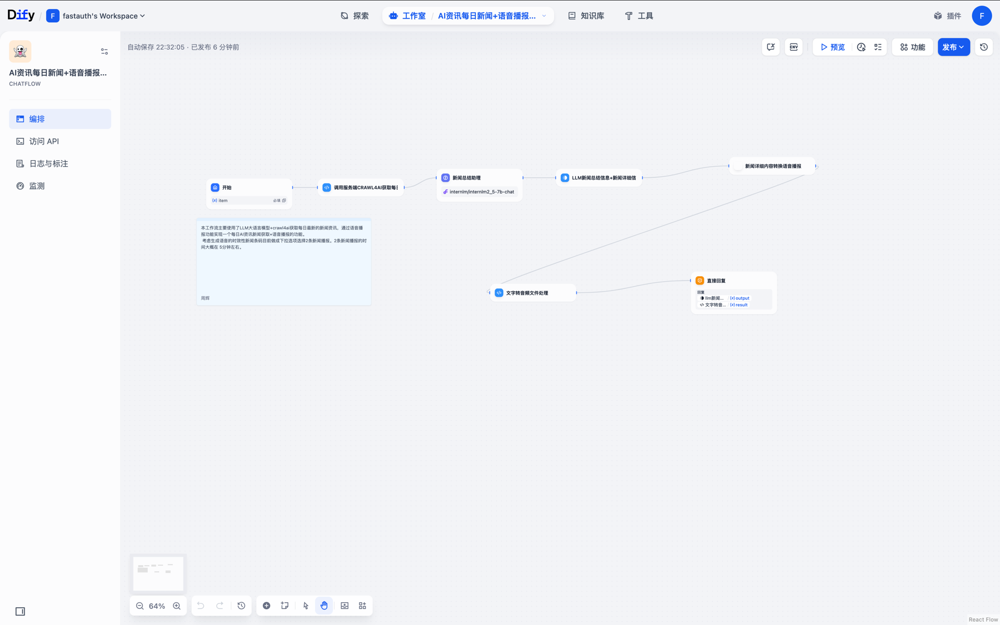

# AI资讯每日新闻+语音播报工作流

这个工作流用于自动收集AI领域的最新新闻，从AIbase网站抓取数据并提供结构化的新闻信息，同时支持语音播报功能。



## 功能

- 从AIbase网站抓取最新的AI相关新闻
- 使用 internlm/internlm2_5-7b-chat 模型对新闻进行智能总结
- 返回新闻标题、内容、发布日期等信息
- 支持通过下拉选项控制新闻数量（推荐2条，约5分钟语音播报时长）
- 提供新闻总结和详细内容的文本输出
- 使用 FunAudioLLM/CosyVoice2-0.5B 模型将新闻内容转换为语音播报

## 目录结构

```
ai-news/
├── AI资讯每日新闻+语音播报工作流.yml  # 工作流配置文件
├── images/                        # 工作流截图和说明图
│   └── img.png
└── README.md                      # 当前文档
```

## 输入参数

| 参数名 | 类型 | 必填 | 说明 | 默认值 |
|-------|------|------|------|-------|
| 新闻数量 | 选项 | 是 | 通过下拉选项选择新闻数量 | 2 |

注意：推荐选择 2 条新闻，这样语音播报的时长大约在 5 分钟左右，便于收听。

## 返回数据结构

工作流会返回以下内容：

1. 新闻总结（由 internlm/internlm2_5-7b-chat 模型生成）：
   - 摘要
   - 文章要点（带序号）

2. 新闻详细内容

3. 语音播报：
   - 使用 FunAudioLLM/CosyVoice2-0.5B 模型
   - 通过 HTML5 audio 标签提供在线播放功能

示例输出格式：
```
[新闻总结]
摘要：
...

文章要点：
1. ...
2. ...
3. ...

[新闻详细内容]
...

[语音播报]
<audio controls>
  <source src="..." type="audio/mpeg">
</audio>
```

## 错误码

| 错误码 | 说明 |
|-------|------|
| 400 | 参数错误，例如limit超出范围 |
| 500 | 服务器内部错误，可能是抓取过程中出现问题 |

## 使用示例

### API调用

```
GET /api/v1/news?limit=3
```

### 在Dify中使用

1. 导入`AI资讯每日新闻+语音播报工作流.yml`文件到你的Dify项目
2. 配置必要的API密钥和参数（包括语音服务相关配置）
3. 在应用中调用此工作流获取AI新闻数据和语音播报

## 代码实现

本工作流的核心代码已整合到 [FastAuthCode/Dify-Http-Service](https://github.com/FastAuthCode/Dify-Http-Service) 项目中。如需查看完整实现或进行二次开发，请参考该项目。

### 主要实现逻辑

1. 使用网络爬虫从AIbase网站获取最新AI新闻
2. 解析HTML内容，提取新闻标题、发布日期和内容
3. 格式化数据并返回结构化的JSON响应
4. 生成拼接后的新闻详情字符串，便于在LLM提示中使用

## 部署说明

1. 确保你有权限访问AIbase网站
2. 配置适当的请求频率，避免对目标网站造成过大负载
3. 考虑添加缓存机制，减少重复请求

## 注意事项

- 请遵守AIbase网站的使用条款和robots.txt规定
- 建议设置合理的抓取频率，避免IP被封禁
- 数据仅供参考，实际使用时请验证信息的准确性

---

[返回主页](../../README.md)
