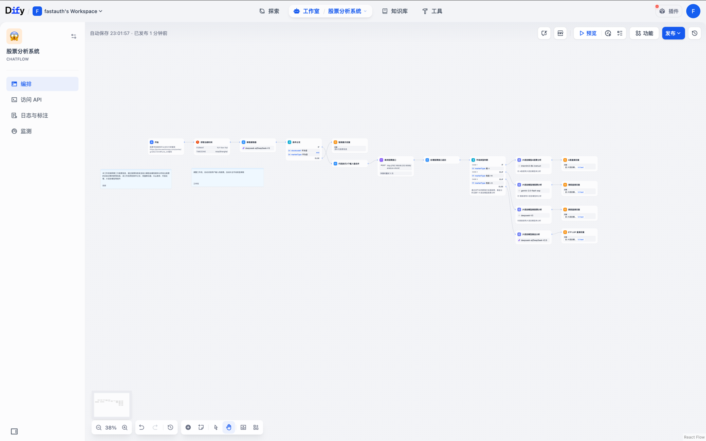

# 股票数据分析工作流

## 项目概述
本工作流基于Dify平台实现了一个智能的股票数据分析系统，通过调用第三方股票信息接口，结合大模型分析能力，为用户提供专业的股票分析和投资建议。



## 功能特点
- 支持多市场分析：A股、港股、美股、ETF基金、LOF基金
- 智能市场识别：自动识别用户输入的股票代码所属市场
- 多维度分析：技术指标、K线数据、成交量等综合分析
- 差异化分析策略：针对不同市场特点使用不同的分析模型
- 专业投资建议：包含支撑位、压力位、目标价位等具体建议

## API接口说明

### 分析接口 `/api/v1/analyze`

#### 请求参数
```json
{
    "stock_code": "600519",    // 股票代码
    "market_type": "A",        // 市场类型：A(A股), HK(港股), US(美股), ETF, LOF
    "start_date": "20250101",  // 开始日期（可选）
    "end_date": "20250517"     // 结束日期（可选）
}
```

#### 返回数据
```json
{
    "technical_summary": {
        // 技术指标概要
    },
    "recent_data": {
        // 近期交易数据
    },
    "report": {
        // 分析报告
    }
}
```

#### 错误码
- 400: 参数错误（股票代码无效/日期格式错误）
- 500: 服务器内部错误

## 工作流程说明

1. **输入处理**
   - 用户输入股票相关信息
   - 系统自动识别股票代码和市场类型
   - 参数提取器提取关键信息

2. **数据获取**
   - 调用第三方股票数据接口
   - 获取实时行情和历史数据
   - 计算技术指标

3. **智能分析**
   - 根据市场类型选择不同的分析模型：
     * A股：使用 internlm3-8b-instruct 模型
     * 港股：使用 gemini-2.0-flash-exp 模型
     * 美股：使用 deepseek-V3 模型
     * 基金：使用 deepseek-ai/DeepSeek-V2.5 模型

4. **结果输出**
   - 生成专业分析报告，包含：
     * 趋势分析（支撑位和压力位）
     * 成交量分析
     * 风险评估
     * 目标价位
     * 关键技术位
     * 具体交易建议

## 使用示例

### A股分析示例
```text
用户输入：分析贵州茅台的走势

系统处理：
1. 自动识别股票代码：600519
2. 确定市场类型：A股
3. 获取股票数据
4. 使用A股专用模型进行分析
5. 生成完整分析报告
```

### 港股分析示例
```text
用户输入：分析腾讯控股

系统处理：
1. 自动识别股票代码：00700.HK
2. 确定市场类型：港股
3. 获取股票数据
4. 使用港股专用模型进行分析
5. 生成完整分析报告（港币计价）
```

## 注意事项
1. 股票代码格式要求：
   - A股：6位数字（如：600519）
   - 港股：5位数字（如：00700）
   - 美股：标准股票代码（如：AAPL）

2. 数据时效性：
   - 实时数据有15分钟延迟
   - 历史数据最多支持查询近5年数据

3. 使用限制：
   - 每个API key每分钟最多请求60次
   - 每次分析的时间范围最长为1年

## 环境要求
- API Key：需要配置有效的API密钥
- 网络要求：确保能访问第三方股票数据接口
- 时区设置：默认使用亚洲/上海时区

## 更新日志
- 2024-01-19: 新增自动识别股票市场类型功能
- 2024-01-18: 优化了分析模型的选择逻辑
- 2024-01-17: 初始版本发布
